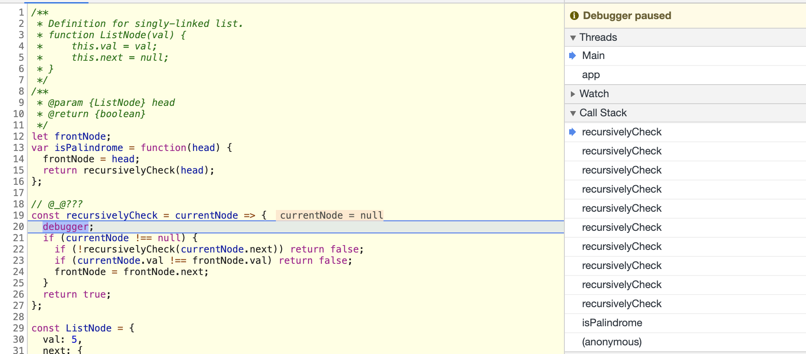

# 234. Palindrome Linked List

https://leetcode.com/problems/palindrome-linked-list/

## 문제

Given a singly linked list, determine if it is a palindrome.

**Example 1:**

```
Input: 1->2
Output: false
```

**Example 2:**

```
Input: 1->2->2->1
Output: true
```

**Follow up:**
Could you do it in O(n) time and O(1) space? 😭

## 내 Solution

```js
/**
 * Definition for singly-linked list.
 * function ListNode(val) {
 *     this.val = val;
 *     this.next = null;
 * }
 */
/**
 * @param {ListNode} head
 * @return {boolean}
 */
var isPalindrome = function(head) {
    if(!head) return true;

    let next = head.next;
    const list = [head.val];
    
    while(next) {
        list.push(next.val);
        next = next.next;
    }
    
    const Listlength = list.length;
    const half = Math.floor(Listlength / 2);
    
    for(let i = 0; i < half; i++) {
        if(list[i] !== list[Listlength - i - 1]) return false;
    } 
    
    return true;
};
```

## 결과

Runtime: 64 ms, faster than 69.68% of JavaScript online submissions for Palindrome Linked List.

Memory Usage: 39.9 MB, less than 66.67% of JavaScript online submissions for Palindrome Linked List.

**Detail**

https://leetcode.com/submissions/detail/312264242/

## User Solution

```js
/**
 * Definition for singly-linked list.
 * function ListNode(val) {
 *     this.val = val;
 *     this.next = null;
 * }
 */
/**
 * @param {ListNode} head
 * @return {boolean}
 */
let frontNode;
var isPalindrome = function(head) {
  frontNode = head;
  return recursivelyCheck(head);
};

// @_@???
const recursivelyCheck = currentNode => {
  if (currentNode !== null) {
    if (!recursivelyCheck(currentNode.next)) return false;
    if (currentNode.val !== frontNode.val) return false;
    frontNode = frontNode.next;
  }
  return true;
};

const ListNode = {
  val: 5,
  next: {
    val: 4,
    next: {
      val: 3,
      next: {
        val: 2,
        next: {
          val: 1,
          next: {
            val: 2,
            next: {
              val: 3,
              next: {
                val: 4,
                next: {
                  val: 5,
                  next: null,
                },
              },
            },
          },
        },
      },
    },
  },
};

console.log(isPalindrome(ListNode))
```

debugger를 이용해서 체크해보자.

```js
if(currentNode !== null){ 
  if(!recursivelyCheck(currentNode.next)) return false;
  if(currentNode.val !== frontNode.val) return false;
  frontNode = frontNode.next;
}
```



이 부분에서 `currentNode` 가 있을경우 `recursivelyCheck(currentNode.next)` 이 부분이 계속 실행되서 `recursivelyCheck` 이 함수가 Call Stack으로 계속 쌓인다.

`next가 null`일때 `callstack` 으로 쌓였던 재귀함수들이 하나씩 실행된다.

`마지막 val: 5`랑  `isPalindrome` 에서 맨처음 설정한 `frontNode = head;` ListNode 전체가 담긴 `frontNode의 첫번째 value 5`와 비교한다. 

그리고 true면 frontNode는 frontNode.next로 변경


만약 결과값이 false일 때는 `if (currentNode.val !== frontNode.val) return false;` 이 부분에서 false가 return 되고 그후 쌓인 CallStack들이 `if (!recursivelyCheck(currentNode.next)) return false;` 이 부분에서 return false를 탄다.


☺️재귀함수 스터디로 채고인거 같다.


